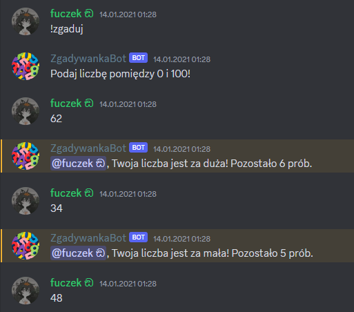
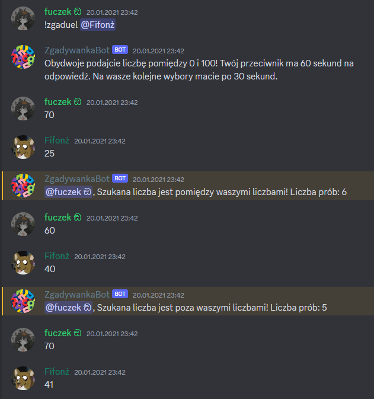
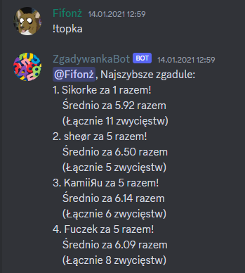

# ZgadywankaBot 

ZgadywankaBot is a game-bot for Discord.js v12 that allows players to play a game of "Guess the number". The bot uses a Mongo.db database that allows for keeping track of player statistics per server.

This was an end-of-semester project that got expanded later by adding a duel feature and per-server leaderboard.

It only supports Polish language.

Commands:

!zgaduj - starts the game sequence

!zgaduel @player - allows to challenge another player

!topka - shows the leaderboard.

